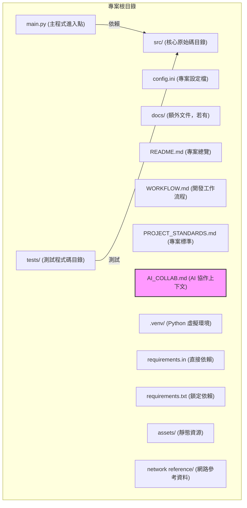

# 專案開發規範 (Project Development Standards)

## 引言：規範目的

本文件旨在為所有新專案提供統一的開發標準、風格和流程。遵循這些規範，能確保專案程式碼品質、提升可維護性、促進團隊協作效率，並加速新成員的上手速度。特別是與大型語言模型 (LLM) 協作時，明確的規範能大幅減少溝通成本與誤解。

## 核心原則

*   **測試驅動開發 (Test-Driven Development, TDD)**：所有功能開發都必須遵循 TDD 流程。先撰寫失敗的測試，再實現最精簡的程式碼使其通過，最後進行重構。
*   **文件先行 (Documentation First)**：在開發初期就應建立並持續維護專案文件，確保文件與程式碼同步更新。
*   **模組化與清晰性**：程式碼應具備高內聚、低耦合的特性，並保持清晰、易讀的風格。
*   **環境隔離**：所有專案都必須使用虛擬環境管理相依套件。我們推薦並在本專案中使用 `uv` 來建立和管理虛擬環境。

## 專案架構規範

所有新專案應遵循以下標準目錄結構。

*   **`main.py`**: 專案的主程式進入點。
*   **`src/`**: 存放所有核心功能的 Python 原始碼模組。
*   **`tests/`**: 存放所有 `pytest` 測試程式碼。
*   **`assets/`**: 存放專案所需的靜態資源，例如 CSS 樣式表、圖片等。
*   **`network reference/`**: 存放與網路設定相關的參考文件或腳本。
*   **`docs/`**: 存放專案的額外文件，例如詳細設計文件、API 文件等（若有）。
*   **`config.ini`**: 專案的所有可變設定參數應集中於此。
*   **`README.md`**: 專案的快速總覽、安裝與使用指南。
*   **`WORKFLOW.md`**: 標準化的開發工作流程，包含環境設定與常用指令。
*   **`PROJECT_STANDARDS.md`**: (本文件) 定義專案的開發標準。
*   **`CHANGELOG.md`**: 記錄專案版本變更的日誌。
*   **`ROADMAP.md`**: 專案的開發路線圖，用於追蹤進度與未來規劃。
*   **`AI_COLLAB.md`**: 專案的核心上下文、總結與開發注意事項。
*   **`.venv/`**: Python 虛擬環境目錄，由 `uv venv` 建立，應被 `.gitignore` 忽略。
*   **`requirements.in`**: 定義專案的**直接**相依套件。
*   **`requirements.txt`**: 由 `uv pip compile` 從 `requirements.in` 自動生成，記錄所有相依套件（包含子依賴）的精確版本，**不應手動修改**。

## 輔助腳本 (Utility Scripts)

專案根目錄下包含一些用於輔助開發的 Python 腳本：
*   **`get_report_filename.py`**: 用於生成帶有時間戳的標準化測試報告檔名。
*   **`run_integration_tests.py`**: 用於執行特定整合測試的腳本。

## 程式碼規範

*   **語言**: 統一使用 Python 3.x。
*   **程式碼風格**: 嚴格遵循 [PEP 8 -- Style Guide for Python Code](https://peps.python.org/pep-0008/)。建議使用 `flake8` 或 `black` 等工具進行自動檢查與格式化。
*   **註解與 Docstrings**:
    *   所有模組、類別、函式都必須撰寫 Docstrings，遵循 [PEP 257 -- Docstring Conventions](https://peps.python.org/pep-0257/)。
    *   複雜的邏輯或不直觀的程式碼行應適當加入行內註解。
*   **錯誤處理**: 應使用 `try-except` 區塊進行適當的錯誤處理，避免程式因未預期的錯誤而崩潰。
*   **系統互動**: 執行系統指令時，應優先使用 Python 內建的 `subprocess` 模組，並注意安全性與跨平台相容性。

## 文件規範

所有專案文件應遵循以下規範，並盡量使用**台灣繁體中文及其慣用語法**。

*   **`README.md`**:
    *   應包含「專案交接總覽」區塊，提供專案目標、技術棧、架構圖、TDD 流程。
    *   提供「快速上手」指南，包含環境需求、安裝與設定步驟。
    *   提供「使用方法」與「開發相關」指南（執行測試、產生報告）。
*   **`CHANGELOG.md`**:
    *   遵循 [Keep a Changelog](https://keepachangelog.com/zh-TW/1.0.0/) 規範。
    *   遵循 [語意化版本 (Semantic Versioning)](https://semver.org/lang/zh-TW/)。
*   **`ROADMAP.md`**:
    *   作為開發路線圖，使用 Markdown 的待辦事項列表 (`- [ ]` 和 `- [x]`) 追蹤功能進度。
*   **`AI_COLLAB.md`**:
    *   作為專案的核心上下文與知識庫，包含專案總結、開發注意事項與 LLM 協作提示。

## 測試規範

*   **測試框架**: 統一使用 `pytest`。
*   **測試類型**: 鼓勵撰寫單元測試 (Unit Tests) 和功能整合測試 (Functional Integration Tests)。
*   **測試報告**: 建議使用 `pytest-html` 套件產生 HTML 格式的測試報告，方便查閱與分享。
    *   **命名規範**: 測試報告檔案應以 `test_report_<版本/里程碑>_<YYYYMMDD_HHMMSS>.html` 格式命名，例如 `test_report_v0.6_20250702_143000.html`。報告應儲存在專案根目錄下的 `test_reports/` 目錄中。

## 版本控制規範

*   **版本控制系統**: 統一使用 Git。
*   **提交訊息 (Commit Messages)**: 建議遵循 [Conventional Commits](https://www.conventionalcommits.org/en/v1.0.0/) 規範，例如：
    *   `feat: 新增功能描述` (新增功能)
    *   `fix: 修正錯誤描述` (錯誤修正)
    *   `refactor: 重構程式碼描述` (程式碼重構)
    *   `docs: 更新文件描述` (文件更新)
*   **`.gitignore`**: 必須包含虛擬環境目錄 (`.venv/`)、`__pycache__/`、`.pyc` 檔案以及其他不應提交到版本庫的檔案。
