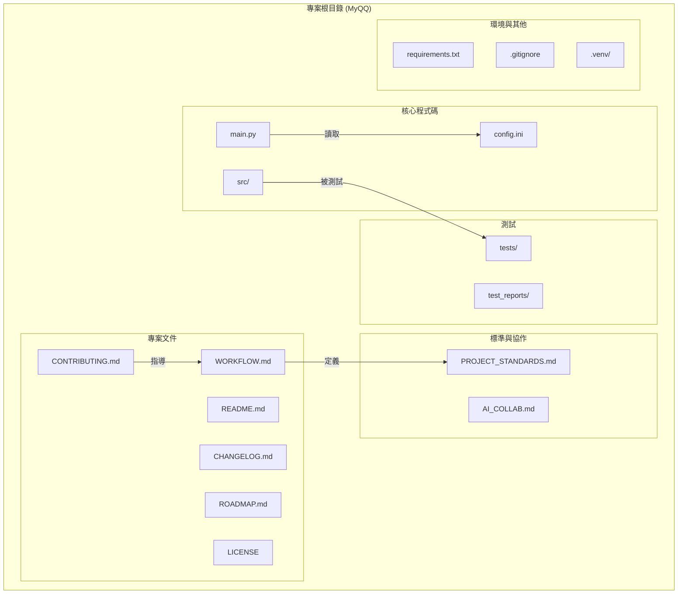

# 網路切換工具 (Network Switcher)

## 專案交接總覽 (Project Handover Overview)

#### **1. 專案目標**
本專案旨在開發一個名為 "Network Switcher" 的命令列工具，用於快速切換 Windows 作業系統的網路設定，例如網路路由、系統 Proxy 等。

#### **2. 技術棧**
*   **語言**: Python 3.x
*   **測試框架**: `pytest`
*   **相依性管理**: 使用 Python 內建的 `venv` 模組建立虛擬環境，並透過 `pip` 管理專案所需的套件。

#### **3. 專案架構圖**


---

## 專案結構與文件導覽

為了幫助您快速了解本專案，我們建議您根據您的身分，從以下文件開始：

*   **如果您是使用者 (User):**
    *   **[README.md](README.md) (就是本文件)**: 了解專案目標、功能和如何快速安裝使用。
    *   **[LICENSE](LICENSE)**: 了解本專案的使用授權。
    *   **[CHANGELOG.md](CHANGELOG.md)**: 查看最新的版本變更。

*   **如果您是貢獻者 (Contributor):**
    *   請務必從 **[CONTRIBUTING.md](CONTRIBUTING.md)** 開始，它將引導您完成：
        *   設定開發環境。
        *   了解我們的 **[開發工作流程 (WORKFLOW.md)](WORKFLOW.md)**。
        *   遵循我們的 **[專案標準 (PROJECT_STANDARDS.md)](PROJECT_STANDARDS.md)**。
        *   使用 GitHub Issues 回報問題或建議。

*   **如果您是 AI 協作者 (AI Agent):**
    *   請優先讀取 **[AI_COLLAB.md](AI_COLLAB.md)**，以獲取為 AI 優化的專案上下文和協作指南。

---

## 快速上手

### 環境需求
- Python 3.x

### 安裝與設定

1.  **複製專案庫：**
    ```sh
    git clone <your-repo-url>
    cd MyQQ
    ```

2.  **建立並啟用虛擬環境：**
    本專案使用虛擬環境來管理相依套件。
    ```sh
    # 建立虛擬環境
    py -m venv .venv

    # 啟用虛擬環境
    .venv\Scripts\activate
    ```
    *啟用後，您的命令提示字元前端會出現 `(.venv)` 字樣。*

3.  **安裝相依套件：**
    在虛擬環境啟用後，安裝所有必要的套件。
    ```sh
    pip install pytest pytest-html
    ```

## 使用方法

在專案根目錄下，執行以下指令來啟動主程式：
```sh
python main.py
```
*請注意：您必須在具有「系統管理員」權限的終端機中執行此指令，工具才能正常運作。*

## 開發相關

### 執行測試

本專案使用 `pytest` 進行測試。在啟用虛擬環境後，於專案根目錄執行以下指令即可運行所有測試：
```sh
pytest
```

### 產生測試報告

若要產生詳細的 HTML 格式測試報告，請執行：
```sh
pytest --html=test_report.html
```
此指令會在專案根目錄下建立一個名為 `test_report.html` 的檔案。
