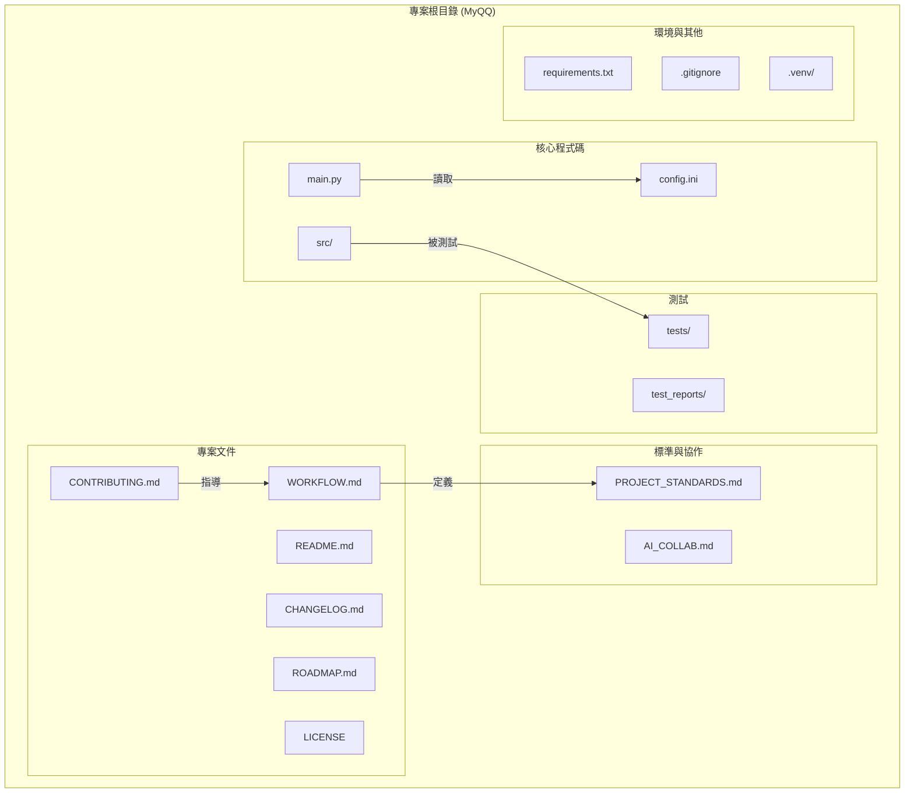

# 網路切換工具 (Network Switcher)

## 專案交接總覽 (Project Handover Overview)

#### **1. 專案目標**
本專案旨在開發一個名為 "Network Switcher" 的命令列工具，用於快速切換 Windows 作業系統的網路設定，例如網路路由、系統 Proxy 等。

#### **2. 技術棧**
*   **語言**: Python 3.x
*   **測試框架**: `pytest`
*   **環境與相依性管理**: `uv`

#### **3. 專案架構圖**


---

## 專案結構與文件導覽

為了幫助您快速了解本專案，我們建議您根據您的身分，從以下文件開始：

*   **如果您是使用者 (User):**
    *   **[README.md](README.md) (就是本文件)**: 了解專案目標、功能和如何快速安裝使用。
    *   **[LICENSE](LICENSE)**: 了解本專案的使用授權。
    *   **[CHANGELOG.md](CHANGELOG.md)**: 查看最新的版本變更。

*   **如果您是貢獻者 (Contributor):**
    *   請務必從 **[CONTRIBUTING.md](CONTRIBUTING.md)** 開始，它將引導您完成：
        *   設定開發環境。
        *   了解我們的 **[開發工作流程 (WORKFLOW.md)](WORKFLOW.md)**。
        *   遵循我們的 **[專案標準 (PROJECT_STANDARDS.md)](PROJECT_STANDARDS.md)**。
        *   使用 GitHub Issues 回報問題或建議。

*   **如果您是 AI 協作者 (AI Agent):**
    *   請優先讀取 **[AI_COLLAB.md](AI_COLLAB.md)**，以獲取為 AI 優化的專案上下文和協作指南。

---

## 快速上手

本專案使用 `uv` 來統一管理開發環境與依賴，提供流暢的設定體驗。

### 環境需求
- [Python 3.x](https://www.python.org/downloads/)
- [uv](https://github.com/astral-sh/uv) (可透過 `pip install uv` 安裝)

### 安裝與設定

1.  **複製專案庫：**
    ```sh
    git clone https://github.com/ChingHaoHuang/Network_Switcher.git
    cd Network_Switcher
    ```

2.  **建立虛擬環境：**
    `uv` 會在專案根目錄下建立一個 `.venv` 資料夾來存放虛擬環境。
    ```sh
    uv venv
    ```

3.  **安裝相依套件：**
    此指令會讀取 `requirements.txt` 並將所有依賴安裝到 `.venv` 中。
    ```sh
    uv pip sync requirements.txt
    ```
    設定完成！您的開發環境已經準備就緒。

## 使用方法

在專案根目錄下，使用 `uv run` 來執行主程式：
```sh
uv run python main.py
```
*請注意：您必須在具有「系統管理員」權限的終端機中執行此指令，工具才能正常運作。*

## 開發相關

### 執行測試

使用 `uv run` 來執行 `pytest`，它會自動使用虛擬環境中的測試框架。
```sh
uv run pytest
```

### 產生測試報告

同樣使用 `uv run` 來執行含有參數的指令。
```sh
uv run pytest --html=test_report.html
```
此指令會在專案根目錄下建立一個名為 `test_report.html` 的檔案。
